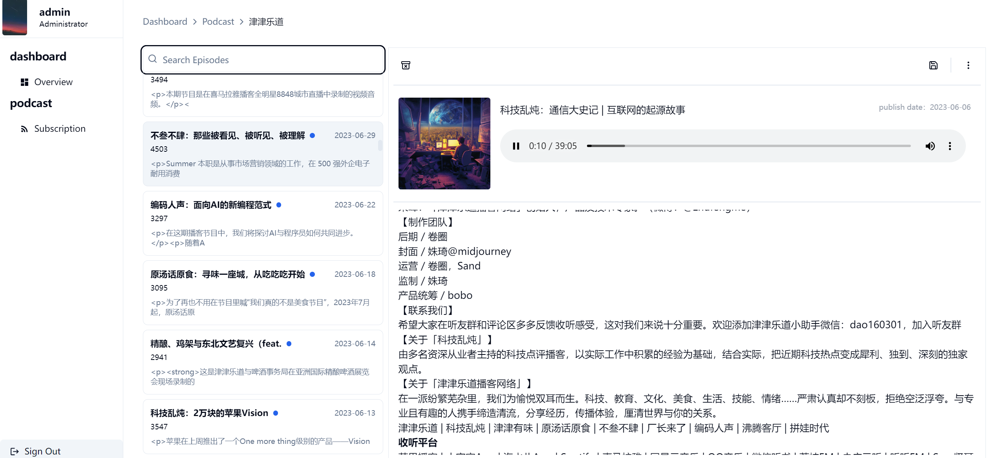

# aurora: simple podcast subscription program

Simple browser-based desktop podcast subscription program


## open-source
* [NextJS](https://nextjs.org/)
* [Shadcn UI](https://ui.shadcn.com)
* [prisma](https://www.prisma.io/)
* [tailwindcss](https://tailwindcss.com/)

## Getting Started

### 1. Clone the repository and install dependencies


```bash
npm install
npx prisma generate
npx prisma migrate dev --name init


```

### 2. Configure your local environment
```
.env
```

### 3. Run

```bash
npm run dev
```


Open [http://localhost:3000/dashboard](http://localhost:3000/dashboard) with your browser to see the result.



